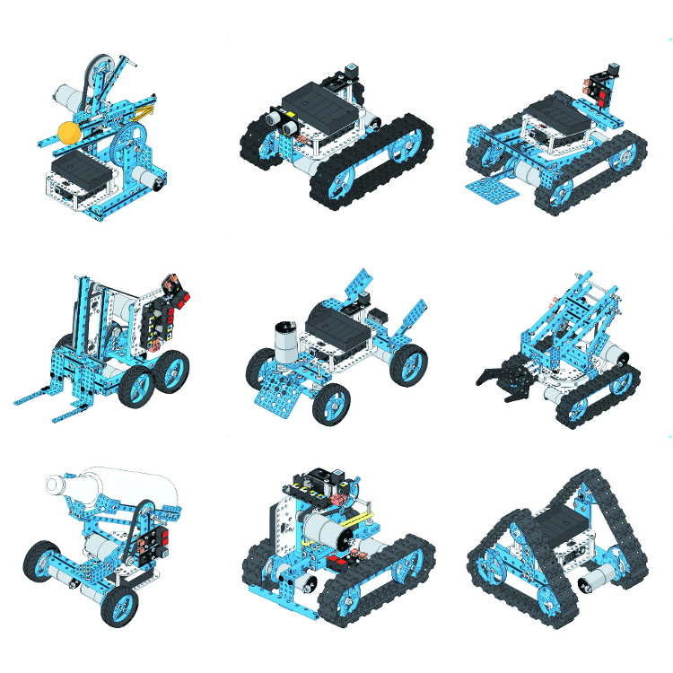

# UltimateRobot
A project using the [Ultimate Robot Kit](https://www.makeblock.com/project/ultimate-robot-kit) from MakeBlock paired with an [Azure Percept](https://azure.microsoft.com/en-us/services/azure-percept/) to demonstrate the power of Azure Cognitive services combined with maker fun.

**The project uses the following hardware components** 
- Azure Percept with camera sensor connecting to Azure Cognitive Services
- Makeblock robot with MegaPi arduino control board.  The board will drive the motors that make the robot interactive.
- Raspberry Pi.  This will interface with the MegaPi and host scripts that will tie all the components together.

**The project uses the following software components**
- Azure Cognitive Services scanning what appears infront of the camera sensor.
- NodeJS script based off Azure quickstart "Send telemetry from a device to an IoT hub and read it with a back-end application" 
- Python script which reads telemtry from NodeJS web service and directs the MegaPi 
based on labels in the telemetry.  This script will be based on the expressJS script in the Lego project linked below.
 

**Useful Links to Build from**

[MakeBlock for MegaPi](https://github.com/codess-aus/PythonForMegaPi?organization=codess-aus&organization=codess-aus)

[Makeblock MegaPi](http://learn.makeblock.com/en/megapi/)

[Perceptmobile: Azure Percept Obstacle Avoidance LEGO Car](https://techcommunity.microsoft.com/t5/internet-of-things/perceptmobile-azure-percept-obstacle-avoidance-lego-car/ba-p/2352666)

[Make a smart webcam in JavaScript with a TensorFlow.js pre-trained Machine Learning model](https://codelabs.developers.google.com/codelabs/tensorflowjs-object-detection#0)
